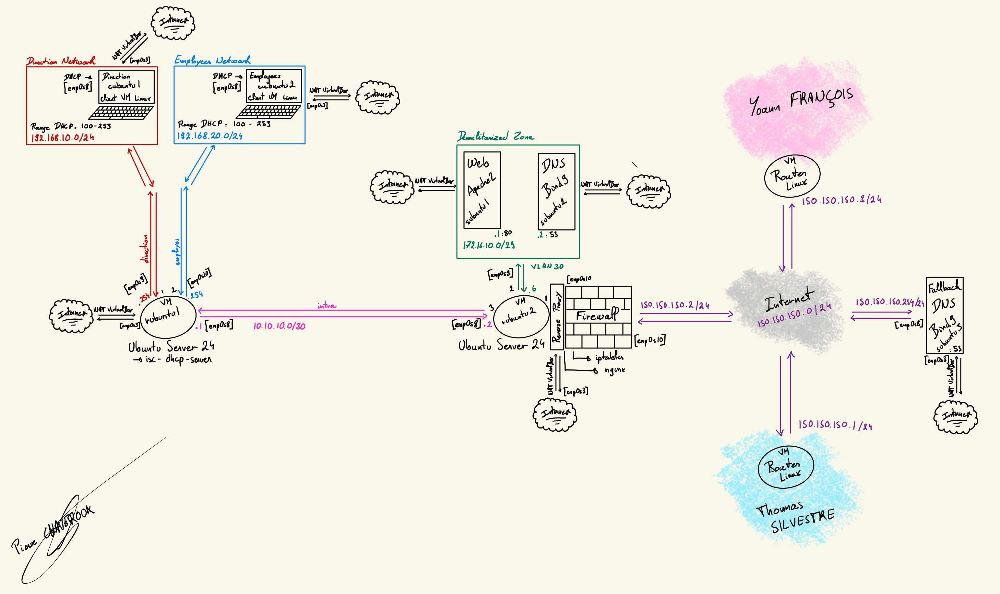

# README: Pierre Chaveroux

This project was conducted as part of the first-semester networking project in the FISA-SN program at INP-ENSEEIHT.

This branch corresponds to the individual work carried out by **Pierre Chaveroux**. Details on the group’s network interconnection can be found in the `main` branch.

---

## Network Architecture Overview

Below is an illustration of my implemented network architecture: 

---

## Key Technical Choices

The project, titled **"Enterprise Network Deployment Project"**, simulates a small business network with employees, management (direction), and on-premises servers.

### Architecture Composition
The network is divided into three main sub-networks: 

1. **Private networks for internal users**: 
   - Two separate sub-networks configured with dynamic addressing via DHCPv4. 
   - Management network: `192.168.10.0/24`. 
   - Employee network: `192.168.20.0/24`. 
   - Each host is provided with full network configuration (IP, mask, gateway, and DNS) by the DHCP server.

2. **Public network (DMZ)** for exposed servers: 
   - Addressed as `172.16.10.0/29`, it hosts two proprietary servers: a Web server and a DNS server.

3. **Interconnection network** with group members (Thomas Silvestre and Yoann François): 
   - Addressed as `150.150.150.0/24`, it includes a fallback DNS server queried when local DNS fails to resolve domain names. 

### Key Features of the Architecture
- **Nginx Proxy** on the edge router to allow external access to the Web server (rubuntu2). 
- **Web server** to allow local and external access to the enterprise resources (subuntu1).
- **DNS server with local authority and fallback**: 
  - The local authority (subuntu2) resolves the private domain `pchaveroux.webserver.com`. 
  - The fallback DNS (subuntu3) resolves other domains: `tsilvestre.webserver.com` and `yfrancois.webserver.com`. 
- **DHCP server** for dynamic IPv4 addressing of internal clients (rubuntu1). 
- **Firewalling with IPtables** on the edge router (rubuntu2) (NAT, DNS, DHCP, and Web filtering). 

Configuration files are available in the annex for further technical insight. 

---

## Challenges and Solutions

## Main Challenges and Solutions

| **Challenge**                            | **Solution**                                                                                       |
|------------------------------------------|---------------------------------------------------------------------------------------------------|
| **Fallback DNS setup**                   | The `dnssec-validation yes;` option, intended for enhanced security, prevented proper domain name resolution. Disabling it resolved the issue. |
| **IPtables rules configuration**         | Rules were reorganized into a dedicated file. Reviewing HTTP chronograms helped me fix the issues quickly. |

---

## Potential Improvements
1. **Adding new services** such as an FTP or LDAP server to enhance the real infrastructure. 
2. **Enhancing network security** by: 
   - Using a dedicated hardware firewall : Fortinet or Stormshield (not the best, but French Power !). 
   - Implementing an EDR system to enhance the architecture security. 

---

## Equipment and Interface Configuration

| **Official_Name**    | **Intelligible Name**    | **Interface**          | **IP Address**               |
|----------------------|--------------------------|------------------------|------------------------------|
| **rubuntu2**         | **Edge Router**          | `enp0s3` (internet)    | NAT Machine Hote             |
|                      |                          | `enp0s8` (interne)     | 10.10.10.2/30                |
|                      |                          | `enp0s9` (DMZ)         | 172.16.10.6/29               |
|                      |                          | `enp0s10` (groupe)     | 150.150.150.2/24             |
|----------------------|--------------------------|------------------------|------------------------------|
| **rubuntu1**         | **Internal Router**      | `enp0s3` (internet)    | NAT Machine Hote             |
|                      |                          | `enp0s8` (interne)     | 10.10.10.1/30                |
|                      |                          | `enp0s9` (direction)   | 192.168.10.0/24              |
|                      |                          | `enp0s10` (employees)  | 192.168.20.0/24              |
|----------------------|--------------------------|------------------------|------------------------------|
| **subuntu1**         | **Web Server**           | `enp0s3` (internet)    | NAT Machine Hote             |
|                      |                          | `enp0s8` (DMZ)         | 172.16.10.1/29               |
|----------------------|--------------------------|------------------------|------------------------------|
| **subunut2**         | **Private DNS Server**   | `enp0s3` (internet)    | NAT Machine Hote             |
|                      |                          | `enp0s8` (DMZ)         | 172.16.10.2/29               |
|----------------------|--------------------------|------------------------|------------------------------|
| **subuntu3**         | **Fallback DNS Server**  | `enp0s3` (internet)    | NAT Machine Hote             |
|                      |                          | `enp0s8` (groupe)      | 150.150.150.254/24           |
|----------------------|--------------------------|------------------------|------------------------------|
| **cubuntu1**         | **Direction Client**     | `enp0s3` (internet)    | NAT Machine Hote             |
|                      |                          | `enp0s8` (direction)   | DHCP : 192.168.10.100-253/24 |
|----------------------|--------------------------|------------------------|------------------------------|
| **cubuntu2**         | **Employee Client**      | `enp0s3` (internet)    | NAT Machine Hote             |
|                      |                          | `enp0s8` (employees)   | DHCP : 192.168.20.100-253/24 |
|----------------------|--------------------------|------------------------|------------------------------|

--- 

## Technical Documentation

Detailed configurations for each device: 
- **Client #1 (Administration)**: [cubuntu1](pierre-net/configuration_files/cubuntu1.md). 
- **Client #2 (Employees)**: [cubuntu2](pierre-net/configuration_files/cubuntu2.md). 
- **Router #1 (Private Network + DHCP)**: [rubuntu1](pierre-net/configuration_files/rubuntu1.md). 
- **Router #2 (Public Network + Proxy + Firewall)**: [rubuntu2](pierre-net/configuration_files/rubuntu2.md). 
- **Web Server**: [subuntu1](pierre-net/configuration_files/subuntu1.md). 
- **DNS Server**: [subuntu2](pierre-net/configuration_files/subuntu2.md). 
- **Fallback DNS Server**: [subuntu3](pierre-net/configuration_files/subuntu3.md). 

TCPDUMP Command Sheet : [tcpdump](pierre-net/ressources/tcpdump_sheet.md).

---

