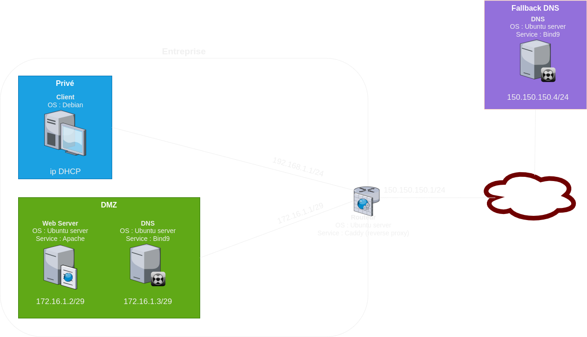

# Network Project Configuration

## Network Topology
The network consists of three main segments:

1. **Internet**: Accessible through the router's `enp0s3` interface (IP: 150.150.150.1/24).
2. **Private Network**: Connected to the router's `enp0s8` interface (IP: 192.168.1.1/24).
3. **DMZ (Demilitarized Zone)**: Connected to the router's `enp0s9` interface (IP: 172.16.1.1/29).



## Machine Details

### Router (Ubuntu Server)
- **Network Interfaces**:
  - `enp0s3`: 150.150.150.1/24 (Internet access).
  - `enp0s8`: 192.168.1.1/24 (Private Network).
  - `enp0s9`: 172.16.1.1/29 (DMZ).

- **Services**:
  - **DHCP**: DHCPD is used, active on `enp0s8` to assign IP addresses to the private network.
  - **Reverse Proxy**: Configured with Caddy for simplicity and efficiency.

#### DHCPD configuration

##### isc-dhcp-server file
```
INTERFACESv4="enp0s8"
```

##### dhcpd.conf file

```
subnet 192.168.1.0 netmask 255.255.255.0 { 
  range 192.168.1.2 192.168.1.100; 
  option routers 192.168.1.1;
  option subnet-mask 255.255.255.0; 
  option domain-name-servers 172.16.1.3;
}
```

#### Caddyfile Configuration

```
150.150.150.1:80 {
   reverse-proxy 172.16.1.2:80
}
```

#### IPTables Configuration

```
# Default Policies
iptables -P INPUT ACCEPT
iptables -P OUTPUT ACCEPT
iptables -P FORWARD DROP

# Allow Ping
iptables -A FORWARD -p icmp -j ACCEPT

# LAN <-> DMZ
iptables -A FORWARD -i enp0s8 -o enp0s9 -p tcp -j ACCEPT
iptables -A FORWARD -i enp0s8 -o enp0s9 -p udp -j ACCEPT
iptables -A FORWARD -i enp0s9 -o enp0s8 -p tcp -j ACCEPT
iptables -A FORWARD -i enp0s9 -o enp0s8 -p udp -j ACCEPT

# Internet <-> DMZ
iptables -A FORWARD -i enp0s9 -o enp0s3 -p udp --dport 53 -j ACCEPT
iptables -A FORWARD -i enp0s9 -o enp0s3 -p tcp --sport 53 -j ACCEPT

# Client <-> Internet
iptables -A FORWARD -i enp0s8 -o enp0s3 -p udp --dport 80 -j ACCEPT
iptables -A FORWARD -i enp0s3 -o enp0s8 -p udp --sport 80 -j ACCEPT
iptables -A FORWARD -i enp0s8 -o enp0s3 -p tcp --dport 80 -m conntrack --ctstate NEW,ESTABLISHED -j ACCEPT
iptables -A FORWARD -i enp0s3 -o enp0s8 -p tcp --sport 80 -m conntrack --ctstate ESTABLISHED -j ACCEPT

# NAT
iptables -t nat -A POSTROUTING -o enp0s3 -j MASQUERADE
```

**Explanation**: The NAT rule (`MASQUERADE`) ensures that all outgoing traffic from the private network appears as if it originates from the router's public IP (`enp0s3`). This allows devices in the private network to access the internet seamlessly.

### Client (Debian)
- Connected to the private network via the `enp0s8` interface.
- Receives its IP address dynamically via DHCP.

### Web Server (Ubuntu Server)
- Located in the DMZ.
- Static IP: 172.16.1.2/29 (interface connected to `enp0s9`).
- Service: Apache.

### DNS Server (Ubuntu Server)
- Located in the DMZ.
- Static IP: 172.16.1.3/29 (interface connected to `enp0s9`).
- Service: Bind9.
- Configured Zone: `tsilvestre.webserver.com`, pointing to the web server (172.16.1.2).

#### DNS Zone File
```
$TTL 86400
@   IN  SOA dns.tsilvestre.webserver.com. admin.tsilvestre.webserver.com. (
    2024121801 ; Serial
    3600       ; Refresh
    1800       ; Retry
    1209600    ; Expire
    86400 )    ; Minimum TTL

@   IN  NS  dns.tsilvestre.webserver.com.
@   IN  A   172.16.1.2
```