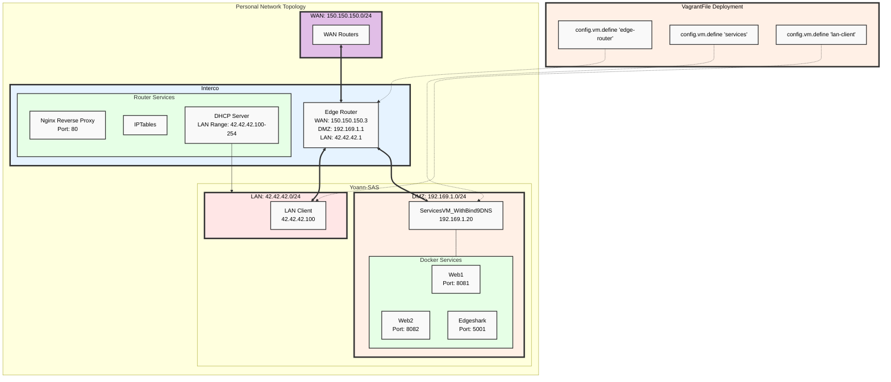

# Yoann's network

Dynamic deployment of my part of the "entreprise network" using **vagrant, virtualbox and docker**.

## Vagrantfile (iptables config, DNS, DHCP, and many more...)

You can view the Vagrantfile [here](./yoannn-net/Vagrantfile).
It is commented and easily understandable, centralizing the whole LAN configuration.

### How-to
Do "sudo vagrant up" in the folder of the "Vagrantfile" in order to deploy the LAN architecture.

## Technical choices
### Deployment
I decided to use **Vagrant** as to introduce myself to the world of Infrastructure as Code. It is not efficient in the context of a small deployment as in this project. However, it was a way for me to further discover the "DevOps" culture and technical history background as it is my current job role.

This method has its virtues as, I believe, declarative configuration is somewhat superior to the imperative way of working. It allows for easier management and checks through versionning. It improves readability whilst making knowledge persistence and teaching far easier. 

The commented Vagrantfile contains the project, an introduction to "entreprise architecture" as a whole in just about 300 LoC.

The following method also offered some reassurance as we knew that if something would fail (perhaps a corrupted VM), we would have the Vagrantfile as a Source of Truth when it came to the multiple configurations of our devices and hosts.

I chose to use a mix of both virtualbox and docker in deployment, docker hosting web services while the rest is deployed in VMs for ease of configuration on critical services (DNS and Reverse Proxy).

### Services choices
| Service Name       | Description                                    | Reason for Choice |
|--------------------|------------------------------------------------|-------------------|
| Nginx Reverse Proxy| Proxy for routing requests to services         | Mainstream reverse-proxy. Used it instead of Traefik for ease of use and lots of tutorials on the web.  |
| DHCP Server        | Provides IP addresses to LAN clients           | Automates IP address assignment in LAN with dhcpd. |
| Web1 (Nginx)       | Web server for Web1 application                | Demonstrates multiple web service deployment. |
| Web2 (Nginx)       | Web server for Web2 application                | - |
| Edgeshark          | Network packet capturing service               | Provides network analysis and troubleshooting capabilities on the docker layer with wireshark and pretty web UI. |
| BIND DNS Server    | DNS service for name resolution                | Enables custom domain name resolution within the network. Textbook choice. |
| IPTables           | Firewall and NAT service                       | Essential for network security and routing between subnets. Used nftables at first but changed back to iptables for uniformity. |

### Services Topology
| Service Name       | Description                                    | IP Address         | Ports              |
|--------------------|------------------------------------------------|---------------------|--------------------|
| **LAN Client**      | Client in the LAN network                       | 42.42.42.100       | -                  |
| **Edge Router**     | Main router connecting WAN, DMZ, and LAN      | WAN: 150.150.150.3   DMZ: 192.169.1.1   LAN: 42.42.42.1 | -                  |
| **->Nginx Reverse Proxy** | Proxy for routing requests to services    | 192.169.1.1        | Port 80            |
| **->DHCP Server**     | Provides IP addresses to LAN clients           | 192.169.1.1        | -                  |
| **Services VM**     | Hosts various services including web servers   | 192.169.1.20       | Port 80 (Apache)   Port 8081 (Web1)   Port 8082 (Web2)   Port 5001 (Edgeshark) |
| **->Web1**            | Nginx web server for Web1 application          | 192.169.1.20       | Port 8081          |
| **->Web2**            | Nginx web server for Web2 application          | 192.169.1.20       | Port 8082          |
| **->Edgeshark**       | Service for network packet capturing            | 192.169.1.20       | Port 5001          |
| **->BIND DNS Server** | DNS service for name resolution                 | 192.169.1.20       | Port 53            |

### Issues
I had trouble getting to know the specificities of Vagrant. Due to some outdated images at first, I had many issues with packages, making me use nftables as an alternative to iptables for some time before I found a fix to it.

When it came to interconnecting ourselves, we encountered issues with DNS and the fallback method. Pierre is the one who found the solution to this issue in one of the parameters of the config file. Props to him ! (See his part in the "Fallback DNS setup" section)

### Improvements
Security is key ! Why not try and deploy a SIEM solution to aggregate log sources and try and simulate a live intrusion ?
For something less sophisticated, implementing 802.1x authentication could be an interesting next step as to seggregate access based on user identity and not just IP addresses.

