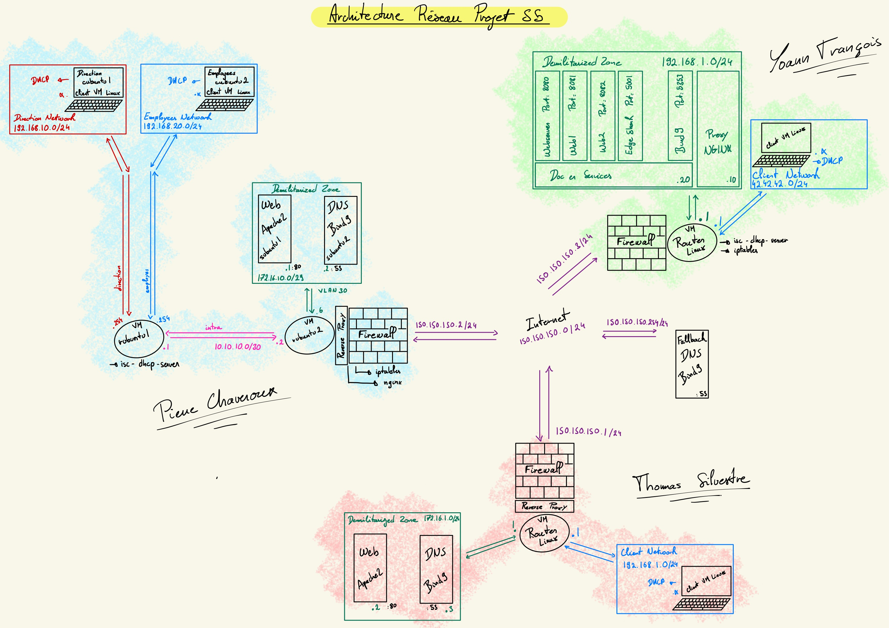

# README

(N5AN01B - Protocoles de l'Internet - Mise en place d’un réseau « d’entreprise »)

This project was carried out as part of the fifth-semester networking project in the FISA-SN program at INP-ENSEEIHT.

This branch corresponds to the work conducted by **Thomas Silvestre**, **Yoann François**, and **Pierre Chaveroux**.
Details about each individual's network infrastructure can be found in their dedicated README files:

- Thomas's architecture: [README-Thomas.md](README-Thomas.md)
- Yoann's architecture: [README-Yoann.md](README-Yoann.md)
- Pierre's architecture: [README-Pierre.md](README-Pierre.md)

---

## Network Architecture Overview

Below is an illustration of the interconnection of our three networks:

---

## Project Description

The goal of this project was to simulate the interconnection of company sites, including dedicated web and DNS servers installed on-premise at each site.

The networking points addressed during this project were as follows:

- **DNS Server**: Configuration of Bind9 with a fallback DNS
- **DHCP**: Deployment of a DHCP server using isc-dhcp-server
- **Reverse Proxy**: Configuration of Nginx or Caddyfile
- **Web Server**: Hosting using Apache2
- **Static Routing**: Implementation of a network architecture based on static routing
- **Automatic Deployment**: Automation of the deployment for Yoann's architecture

---

