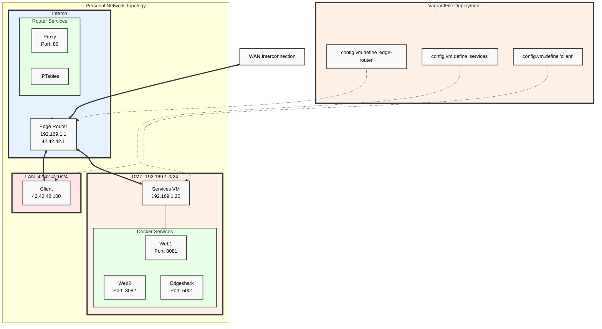

# Entreprise Network setup (N5AN01B - Protocoles de l'Internet - Mise en place d’un réseau « d’entreprise »)

## Yoann's network

Dynamic deployment of the "entreprise network" using **vagrant, virtualbox and docker**.

### How-to :
Do "sudo vagrant up" in the folder of the "Vagrantfile" order to deploy the LAN architecture.

### Technical choices : 
#### Deployment
I decided to use **Vagrant** as to introduce myself to the world of Infrastructure as Code. It is not efficient in the context of a small deployment as in this project. However, it was a way for me to further discover the "DevOps" culture and technical history background as it is my current job role.

This method has its virtues as, I believe, declarative configuration is somewhat superior to the imperative way of working. It allows for easier management and checks through versionning. It improves readability whilst making knowledge persistence and teaching far easier. 

The commented Vagrantfile contains the project, an introduction to "entreprise architecture" as a whole in just about 300 LoC.

The following method also offered some reassurance as we knew that if something would fail (perhaps a corrupted VM), we would have the Vagrantfile as a Source of Truth when it came to the multiple configurations of our devices and hosts.

I chose to use a mix of both virtualbox and docker in deployment, docker hosting web services while the rest is deployed in VMs.

#### Services

#### Issues

### Tasks : 
DONE :
  - Base Vagrantfile
  - Base schema with mermaid.js

TO DO :
  - High level schema draw.io
  - Add comments
  - Edit Readme
  - Ensure connectivity in the LAN
  - Test and PoC of Reverse Proxy
    
[Static schema](yoannn-net/schema_mermaid.png)

